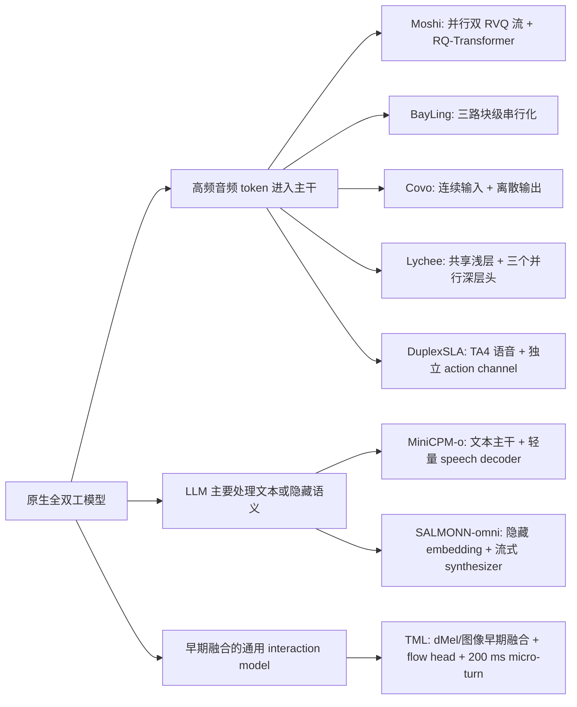

# 原生全双工多模态/语音模型架构调研

> 调研对象：MiniCPM-o 4.5、Moshi、Lychee-FD、BayLing-Duplex、Covo-Audio-Chat-FD、SALMONN-omni、DuplexSLA、TML-Interaction-Small  
> 调研日期：2026-09-04  
> 资料口径：优先采用论文、官方技术报告、官方项目页和官方仓库。本文讨论的是模型级全双工，而不是在半双工模型外增加 VAD、ASR、TTS 和轮次控制器形成的系统级全双工。

## 1. 结论摘要

这八个模型虽然都宣称或实现了“边听边说”，但架构并不属于同一种范式。最核心的分野有三条：

1. **时间复用还是通道并行。** MiniCPM-o 4.5、BayLing-Duplex、Covo-Audio-Chat-FD、SALMONN-omni、DuplexSLA 和 TML-Interaction-Small 将一个很短时间窗内的输入、输出或动作依次序列化，属于时间分块/时间复用思路；Moshi 更典型地把用户和助手音频建模为并行流；Lychee-FD 则在共享浅层之后并行运行语义、声学和控制分支。
2. **LLM 是否直接承担高频声学 token 预测。** Moshi、BayLing-Duplex、Covo-Audio-Chat-FD、Lychee-FD 和 DuplexSLA 都让主干或紧邻主干的分支显式预测离散语音 token；MiniCPM-o 4.5 和 SALMONN-omni 把高频声学生成交给较轻的流式语音生成模块，使大 LLM 主要工作在文本或隐藏表示频率上；TML-Interaction-Small 使用轻量 dMel 输入嵌入和 flow audio head，但未公开更细的声学 token 细节。
3. **对话控制放在哪里。** Moshi 主要通过连续生成“语音或静音”隐式学习轮次；MiniCPM-o 4.5、BayLing-Duplex、Covo-Audio-Chat-FD、SALMONN-omni 用显式状态 token；Lychee-FD 使用独立控制头；DuplexSLA 使用独立、带时间戳的 action channel；TML-Interaction-Small 将轮次控制隐式吸收到 interaction model 中。

低时延并非只来自更快的 GPU。八个模型共同采用的关键方法是：把交互离散成短时间块、使用因果流式前后端、让模型自己做轮次判断、让文本/语义和音频沿同一时钟增量生成，并控制每个时间块内必须生成的 token 数。真正拉开差距的是“每个时间块要做多少次大模型解码”和“停止说话的决策要经过多长的串行路径”。

从公开结果看：

- **最低且定义最清楚的声学算法时延**来自 Moshi：理论 160 ms、实测约 200 ms。但这是其流式音频生成路径时延，不等同于用户说完到模型开口的完整轮次时延。
- **显式报告较低轮次控制时延**的是 DuplexSLA：在其自建基准和上下文预填充条件下，普通接话约 0.27 s、打断停止约 0.40 s、工具调用平均约 0.64 s。
- **TML-Interaction-Small**报告 FD-bench V1 轮次时延 0.40 s，并披露了最完整的在线服务内核优化，但它是闭源研究预览，数字不能由社区复现。
- **MiniCPM-o 4.5**的优势更偏向端侧综合效率和视觉-音频同时交互：INT4 下约 11 GB 内存、llama.cpp-omni 在 RTX 4090 上报告 RTF 0.21；不过论文未给出与 Moshi 相同口径的音频首包/打断时延，并且其最佳消融配置使用 1.0 s 交互块。
- **BayLing-Duplex**架构改造最小、最容易复用既有 SpeechLM 服务栈，但 0.8 s 块大小直接构成最小响应粒度，实测打断后停止平均 1.10 s，不属于这组模型里绝对时延最低的一类。
- **Lychee-FD**的特色是从梯度冲突出发解决“全双工后模型变笨/语音变差”，再用三分支并行和控制头早退避免增加关键路径；其 FullDuplexBench 1.5 打断停止时延为 570 ms。
- **SALMONN-omni**是唯一明确不把音频 codec token 注入 LLM 词表的方案；80 ms 时间块很细，但从“决定开口”到实际音频起播仍有 320 ms 的语音合成积累时延。
- **Covo-Audio-Chat-FD**以 160 ms 块、1:4 输入输出比和 THINK/SHIFT/BREAK token 得到结构简洁的混合双流方案；论文公开了行为成功率，但没有给出可与其他模型直接比较的端到端时延统计。

## 2. 比较口径

### 2.1 本文所称“原生全双工”

一个模型至少应满足以下条件：

- 在助手输出语音时，模型仍持续接收新的用户/环境音频；
- 模型内部表示保留输入与输出在时间上的重叠，而不是先做完整 ASR、再做 LLM、最后做完整 TTS；
- 何时说、何时继续听、何时停下至少主要由同一模型的语义状态决定，而非完全依赖外部 VAD 或固定状态机；
- 训练数据或训练目标显式包含静音、重叠、接话、停顿、打断或 backchannel 等对话动态。

“端到端”并不表示系统只有一个神经网络文件。多数模型仍包含语音编码器、LLM、语音 tokenizer、flow-matching 声学解码器和 vocoder。这里更重要的是这些组件是否被统一训练/对齐，以及轮次控制是否属于模型学习目标。

### 2.2 四种容易混淆的时延

| 指标 | 含义 | 主要受什么影响 |
|---|---|---|
| 帧/块时长 | 模型多久获得一次新输入并有机会改写决策 | codec/encoder 帧率、时间块设计 |
| 算法时延 | 流式编码、声学 token 依赖和解码固有的 look-ahead | 因果性、codec delay pattern、flow decoder |
| 首音频时延 | 模型决定说话后，到客户端听到第一段波形 | 文本前导量、声学 token 缓冲、网络和播放缓冲 |
| 轮次/打断时延 | 用户语义事件发生后，到模型开始说或停止说 | 语义判断、块大小、控制路径、推理速度 |

因此，“Moshi 160 ms”“SALMONN-omni 320 ms”“TML 0.40 s”“MiniCPM-o RTF 0.21”并不是同一个指标，不能按数字直接排序。

## 3. 总体架构对比

| 模型 | 规模/主干 | 输入表示 | 输出语音表示 | 时间组织 | 对话控制 | 额外模态/能力 |
|---|---|---|---|---|---|---|
| MiniCPM-o 4.5 | 约 9B；Qwen3-8B + Whisper Medium + SigLIP + 约 0.3B speech decoder | 连续音频特征，压缩至 10 token/s；视觉 token | S3 离散 speech token + 流式 flow matching | Omni-Flow；视觉/环境音频/输出按时间块串行化；最佳消融为 1.0 s 块 | 独立 Listen/Speak 控制预测 | 原生视觉、音频、文本；主动观察和提醒 |
| Moshi | 约 7B Helium Temporal Transformer + 小型 Depth Transformer + Mimi | Mimi 8 层 RVQ，12.5 Hz，用户独立流 | Mimi 8 层 RVQ，12.5 Hz，助手独立流 | 用户/助手并行音频流；每帧分层预测；助手另有 inner monologue | 主要由语音/静音序列隐式表示 | 语音全双工；流式 ASR/TTS 可由同一框架派生 |
| Lychee-FD | 约 10B；StepAudio-2-mini 初始化；24 层共享 + 4/4/2 层语义/声学/控制头 | Whisper-v3-large 特征 | CosyVoice2 25 Hz 离散 speech token + Token2Wav | 原生 CDM；共享浅层后，三头并行 | 独立 Control Head，Start/Stop token，可早退 | 语音全双工；强调知识保持和语音质量 |
| BayLing-Duplex | GLM-4-Voice 9B | 修改的 Whisper-large-v3 + VQ，12.5 Hz 离散 token | 同一 speech token 词表 + flow matching + HiFi-GAN | 每块 10 用户音频 + 5 文本 + 10 助手音频 token；0.8 s/块 | SILENCE、ASSISTANT、PAD、EPAD 四类状态 token | 语音全双工；无新增模块/辅助头 |
| Covo-Audio-Chat-FD | Qwen2.5-7B-Base | Whisper-large-v3 50 Hz，经 adapter 压至 6.25 Hz 连续特征 | WavLM-large + VQ，16,384 码本、25 Hz；flow matching + BigVGAN | 160 ms 块；1 个输入特征块对应 4 个输出 speech token，另有文本锚点 | THINK、SHIFT、BREAK token | 语音/一般音频理解；强调智能-音色解耦 |
| SALMONN-omni | Llama-3-8B-Instruct + 32 层 Mamba encoder + CosyVoice2-0.5B | 25 Hz 连续隐藏 embedding；环境流和助手回声流 | LLM 隐藏 embedding 驱动流式 CosyVoice2，不向 LLM 注入 codec token | 80 ms 块；环境 embedding、助手 embedding、文本交织 | 显式 THINK/SHIFT；单 LLM 学习状态转移 | 语音全双工；显式建模自回声和背景声 |
| DuplexSLA | 7B，Step-Audio 2 mini 初始化 | 每 160 ms 两个 80 ms 因果用户音频特征 | TA4：1 个文本锚点 + 4 个 40 ms 音频 token | 双音频流、三语义通道；固定 160 ms 时钟 | action channel 中的 response/interrupt/backchannel 标签 | 原生规划、JSON 工具调用，可与语音并行 |
| TML-Interaction-Small | 276B MoE、每 token 激活 12B；从头训练 | dMel + 轻量嵌入；图像 40x40 patch + hMLP | flow audio head；更细表示未公开 | 200 ms micro-turn；输入/输出流交替写入单序列 | interaction model 隐式学习，无外部轮次 harness | 原生音频、视频、文本；异步 background model 处理深度推理/工具 |

### 3.1 架构谱系



这张图表达的是主要计算路径，不是严格的“是否端到端”分类。MiniCPM-o 4.5 和 SALMONN-omni 仍可端到端训练，只是把高频声学生成从大 LLM 的词表解码路径中分离出来。

## 4. 逐模型架构分析

### 4.1 MiniCPM-o 4.5

MiniCPM-o 4.5 是这组模型中与 TML-Interaction-Small 最接近的全模态模型。其重点不是仅把语音助手改成可打断，而是让视觉、环境音频和助手输出共享一条时间轴。

架构由四段组成：

1. **输入编码。** Whisper Medium 以流式分块方式产生 50 个音频特征 token/s，再由两层 MLP 做 5 倍时间压缩，使进入 LLM 的音频负担降到 10 token/s。视觉侧使用 0.4B SigLIP ViT 和 resampler；全双工模式把最大输入分辨率限制为 448x448，并将每个 slice 从 1024 token 压缩到 64 token。
2. **语义主干。** Qwen3-8B 只生成文本 token 和用于语音生成的隐藏状态。论文给出的关键效率判断是：自然说话只需要约 3-4 个文本解码步/s，而让大模型直接生成语音通常需要约 25 步/s。
3. **语音生成。** 一个约 0.3B 的轻量 Llama speech-token decoder 根据文本 token、LLM 隐藏状态和自己的历史生成 S3 speech token；之后由流式 flow-matching decoder 生成波形。语义/韵律决策留在大 LLM，密集声学预测交给小模型。
4. **Omni-Flow。** 每个时间块按 `[视觉 token; 环境音频 token; 输出 token]` 排列。如果不应输出，则输出 `[listen]`。论文比较了 Listen-Speak（先预测是否说，再生成内容）和 Listen-Text（在同一空间直接预测 listen 或文本）两种控制，前者更稳定。

它的 TAIL（Time-Aligned Interleaving）并非固定“每 N 个文本 token 生成 M 个语音 token”，而是根据累计播放进度动态决定本块生成多少文本，并允许有限 look-ahead。这样可以避免文本生成跑在音频播放前面太远，用户或环境变化后仍播放已经过时的内容。

**低时延优化：**

- 输入侧 5 倍音频压缩和视觉侧 16 倍 resampler 压缩；
- 大 LLM 只按文本速率工作，高频语音 token 由 0.3B decoder 负责；
- 流式 Whisper、流式 speech-token decoder 和流式 flow matching；
- TAIL 控制音频播放与最新环境之间的“语义陈旧度”；
- INT4 量化和专门的 llama.cpp-omni 推理框架。论文在 RTX 4090 上报告 INT4 约 212.3 token/s、首 token 0.58 s、11 GB 内存；llama.cpp-omni INT4 报告 RTF 0.21。

**需要注意：**论文的 0.58 s 首 token 测试包含 64 帧视觉输入，RTF 是生成速度指标；二者都不是严格的语音打断停止时延。Omni-Flow 消融中 1.0 s 块效果最好，0.2/0.1 s 虽响应粒度更细但智能指标明显下降。论文的全双工评测主要是视觉连续交互，没有给出与 FullDuplexBench 音频打断同口径的结果。

### 4.2 Moshi

Moshi 是最典型的“真正并行音频通道 + 分层音频自回归”方案，也是后续许多原生全双工模型的参照系。

其三个核心组件为：

1. **Mimi 流式 codec。** 24 kHz 音频被编码为 12.5 Hz 的帧，每帧有 8 层 RVQ code。第一层经 WavLM 蒸馏承载较强语义信息，后续层补充声学细节。Mimi 的卷积和 bottleneck Transformer 都是因果的；拿到首个 80 ms 音频帧即可输出首个 latent，也可解码为 80 ms 波形。
2. **Temporal Transformer。** 约 7B 的 Helium 文本模型改造成沿时间维工作的主干。它每个 80 ms 时间步只前进一次，而不是把 8 个 codebook 和两位说话人的 token 全部拉平成超长序列。
3. **Depth Transformer。** 小型深度 Transformer 在同一时间步内自回归生成不同 codebook 的 token，承担“每帧内部”的声学依赖。最终每步有 8 个用户音频 token、8 个助手音频 token和 1 个助手 inner-monologue 文本 token，共 17 路目标。

Moshi 把用户和助手音频保持为两条独立流，模型始终听、也始终生成声音；输出可以是语音也可以是静音，因此不需要先确定严格轮次。Inner Monologue 在每个音频帧前生成时间对齐文本，提供语言知识和语义骨架，而不需要先生成完整答案再做 TTS。

**低时延优化：**

- Mimi 仅 12.5 Hz，显著低于常见 50 Hz codec，降低大 Temporal Transformer 的前向次数；
- Temporal/Depth 两级结构避免每秒对 8 层 RVQ 做约 100 次大模型串行解码；
- 因果 codec 和有限上下文 bottleneck 支持真正在线编码/解码；
- 训练时采用低延迟 RVQ delay pattern。最终微调使用 1 帧声学延迟，理论时延 160 ms，论文报告实测约 200 ms；
- Inner Monologue 只比纯双音频流每步多 1 个 token，却显著提高语言质量；
- Helium 支持 4-bit 量化，官方实现也提供 Rust/CUDA 等实时推理路径。

**代价：**高频语义、声学和文本任务共享大量参数，存在知识退化和梯度冲突；8 层 RVQ 的训练和推理逻辑较复杂。其 160/200 ms 主要是持续生成路径时延，不保证面对任意语义打断都能在 200 ms 内正确停下。

### 4.3 Lychee-FD

Lychee-FD 直接针对 Moshi/CDM 类架构的一个核心问题：同一深层参数同时学习文本语义和声学重建时，浅层梯度方向相容，深层逐渐正交甚至冲突；同时 25 Hz 音频对齐到约 3 Hz 文本时，大量 padding 会稀释文本监督。

其基础来自 StepAudio-2-mini，输入用 Whisper-v3-large，输出用 CosyVoice2 tokenizer 产生 25 Hz speech token。主干结构为：

- 24 层共享 Transformer，学习语音和语言的通用表征；
- 4 层 Semantic Head，连续生成文本/inner monologue；
- 4 层 Acoustic Head，生成离散 speech token；
- 2 层 Control Head，生成 Start/Stop 等交互控制信号；
- 总规模约 10B。

三条输出通道共享浅层上下文，但深层参数物理分离。Semantic Alignment Channel 使用连续文本监督，而不是只在少数时间位置放文本 token，以防训练被高频声学损失主导。

**低时延优化：**

- 深层分支并行执行，分离参数但不增加单条关键路径的有效深度；
- 25 Hz speech token 提供 40 ms 声学时间粒度；
- 控制头只有 2 层，官方在线实现进一步提供 early-exit，使停止、继续听或开始回答的决定无需等待完整声学分支；
- 定制 vLLM 的 DAG Pipeline Parallelism：共享主干的隐藏状态通过 NCCL 1-to-N 广播到语义、声学、控制 GPU，三个头严格并行；
- 官方仓库报告该多流 vLLM 路径在说话轮中约 2.96 倍加速，长会话增量显存增长减少约 23%。

论文报告 FullDuplexBench 1.5 上打断停止时延为 570 ms。这个数字同时受“是否正确识别语义打断”和“系统执行速度”影响，不能等同于 40 ms token 粒度。

Lychee-FD 的主优化目标不是单纯刷新最低时延，而是在不牺牲全双工速度的前提下保住知识、语义和声学质量。代价是总参数量增加，并且为了让三头真正并行需要多 GPU 和定制服务引擎；单 GPU 串行跑三头时，它的理论并行优势会明显缩小。

### 4.4 BayLing-Duplex

BayLing-Duplex 的思路最“保守”：不改 GLM-4-Voice 的主要网络，也不增加分类头，只改变训练序列布局并加入四类状态 token。

底座由修改的 Whisper-large-v3 + VQ speech tokenizer、9B GLM-4 decoder-only Transformer，以及 CosyVoice 风格的 flow-matching + HiFi-GAN 解码器组成。输入和输出 speech token 都是 12.5 Hz，即每 token 80 ms。

每个块依次放入：

```text
10 个用户 speech token | 5 个助手文本/状态 token | 10 个助手 speech token
```

因此每块覆盖 0.8 s。训练时把助手文本和语音整体向后因果平移一块，使输出只依赖已经收到的用户音频。文本通道充当 inner monologue，并包含：

- `[SILENCE]`：继续静音；
- `[ASSISTANT]`：开始回答；
- `[PAD]`：文本写完但语音仍在播放；
- `[EPAD]`：本次文本和语音都结束。

推理时只需在文本位置屏蔽 speech token、在语音位置屏蔽文本 token，其他部分复用标准 LLM 生成和服务栈。

**低时延优化：**

- 不增加模块、辅助头或复杂 attention mask，避免额外模型调用；
- 双音频流和 inner monologue 在固定块内统一为普通 next-token prediction；
- 冻结 speech tokenizer/decoder，仅全量微调 LLM，工程改造成本低；
- 400K 全双工样本先 SFT，再用只改变时间位置的正负样本做轻量 DPO，使优化聚焦开始/停止时机；
- 降低大量 `[SILENCE]` token 的 loss 权重、提高角色状态 token 权重，避免模型塌缩为永久静音。

它的主要时延限制也很明确：模型每 0.8 s 才重新吸收一块用户输入，最小响应粒度被块长封顶。论文报告 DPO 后平均打断重叠时长 1.10 s，优于其 Moshi 基线的 2.07 s，但论文也明确承认 0.8 s 是最低响应时延下限。若减小块长，文本槽不足会导致接话抖动和不稳定。

### 4.5 Covo-Audio-Chat-FD

Covo-Audio 的基础架构是 Qwen2.5-7B-Base 加四个语音组件：

- Whisper-large-v3 输入编码器，原始输出 50 Hz；
- 三个 adapter 下采样模块，将输入压缩至 6.25 Hz；
- WavLM-large + 单层 VQ 的 speech tokenizer，码本 16,384、输出 25 Hz；
- flow-matching 声学模型 + BigVGAN vocoder，重建 24 kHz 波形。

这种设计在输入和输出两侧有意不对称：用户侧保留连续 Whisper 特征，避免离散化损失；助手侧由离散 speech token 提供高效自回归输出。全双工版本把 encoder 改造成 chunk streaming，并按 1:4 交织两流：每个 160 ms 块读入 1 个 6.25 Hz 用户特征单元，生成一个文本锚点和 4 个 25 Hz speech token。

其状态机被编码成词表 token：

- `THINK`：处于监听/思考状态；
- `SHIFT`：从监听切到说话；
- `BREAK`：自然结束或检测到打断后停止说话。

**低时延优化：**

- 输入 6.25 Hz、输出 25 Hz 的 1:4 对齐恰好构成 160 ms 固定块；
- chunk-streaming Whisper 避免等待完整用户句子；
- 文本锚点先于同块的 4 个 speech token，为语音生成提供局部语义约束；
- 控制 token 与内容 token 共用一次自回归过程，不需要额外 VAD/打断分类器；
- 全双工数据在大规模预训练阶段即被引入，后续用半双工与全双工数据一次性联合微调，减少逐模块训练造成的不一致；
- hierarchical tri-modal interleaving 同时使用连续声学特征、离散语音 token 和文本，兼顾输入保真与输出效率。

论文报告 turn-taking、pause、backchannel、interruption 成功率分别为 99.7%、97.6%、93.89%、96.81%，但没有报告统一硬件上的首音频或打断停止毫秒数。因此只能确认其决策粒度为 160 ms，不能据此宣称端到端时延就是 160 ms。截至本调研日期，官方仓库明确公开的是 Covo-Audio-Chat；Covo-Audio-Chat-FD 的完整可复现权重/在线服务状态应单独核验。

### 4.6 SALMONN-omni

SALMONN-omni 的最大区别是 **codec-free in LLM token space**：LLM 词表里没有离散音频 token，语音模块通过连续隐藏 embedding 与 LLM 相连。

它由三段组成：

1. **Mamba 流式 encoder。** log-Mel 100 Hz 经卷积降至 50 Hz，再合并相邻帧进入 32 个 Mamba block，最终 25 Hz。该 encoder 通过 Whisper-large-v3 教师蒸馏获得通用语音表征。
2. **Llama-3-8B-Instruct。** 环境流（用户、背景声、助手回声）、助手上一段输出的 embedding 和文本 embedding 按时间块交织成单一 soft-token 序列。单个 LLM 同时保持听与说的上下文。
3. **CosyVoice2-0.5B 流式 synthesizer。** 它不读普通文本 token，而读 LLM 中后层隐藏 embedding，经线性对齐后产生流式语音。论文最终选择第 24 层 embedding，在语言能力和合成质量之间折中。

显式 thinking 方案在每个时间块生成 `<think>` 或 `<shift>`。`<think>` 可以表示仍在听，也可以表示文本已经生成完但语音尚未播完；`<shift>` 同时表示 listen->speak 和 speak->listen 的状态切换。双通道输入还把助手自己的输出/回声重新编码进环境上下文，使模型能训练回声容忍和上下文相关的 barge-in。

**低时延优化：**

- Mamba encoder 以线性状态更新处理长流式上下文；
- 不向大 LLM 词表注入 25-100 Hz 的多层 codec token，保留文本模型效率和知识；
- 80 ms 时间块，每听 80 ms 只生成一个文本/状态 token；
- 流式 synthesizer 按固定比例批量生成：LLM 累积 4 token 后生成 12 个 speech token，对应 480 ms 波形；
- 单个 LLM 同时处理两流，避免 Freeze-Omni/VITA 类双 LLM 进程的显存和同步开销；
- DPO 专门优化“真正打断、无关噪声、backchannel”之间的精确率/召回率。

批量声学生成是效率与首包的折中：从模型决定开口到音频真正起播，论文明确给出 320 ms 缓冲时延。其优势是大 LLM 负担轻、知识保持较好；代价是 streaming encoder 和 synthesizer 仍是独立计算组件，且固定比例生成会限制更细粒度的立即停播。

### 4.7 DuplexSLA

DuplexSLA 把全双工语音模型向 agent 扩展：不仅要边听边说，还要在说话不中断的情况下规划和调用工具。

它从 7B Step-Audio 2 mini 初始化，将每 160 ms 对话时间块划分成三条语义通道：

- **User Channel：**2 个 80 ms 因果音频特征，只作为观察输入；
- **Assistant Channel：**一个 TA4 单元，即 1 个 text anchor + 4 个 40 ms 离散 speech token；
- **Action Channel：**最多 10 个文本 token，可承载延迟 ASR、短规划、response/interrupt/backchannel 标签和 JSON 工具调用。

三个通道在块内序列化给同一个 LLM backbone，助手 TA4 和 action text 都是监督输出。`<|action_end|>` 严格结束每个 160 ms 块；若 action 超过 10 token，按 FIFO 延续到后续块，但助手 TA4 继续独立生成，不会被 JSON 或长规划阻塞。

**低时延优化：**

- 固定 160 ms 时钟，输入完全因果，不需要未来音频；
- 每块恒定 5 个助手语音相关 token，并硬限制 action channel 不超过 10 token，使实际解码计算能装进 160 ms wall-clock budget；
- 语音和 action 共用 backbone，轮次判断直接读取生成语音的同一语义状态，不经过外部 semantic VAD；
- action channel 与语音通道解耦，工具调用和规划不会阻塞语音；
- 训练中使用用户、助手双侧延迟 ASR 把文字精确锚定到实际发声块，防止 action 时间漂移；
- 大规模 duplex continued pretraining 先稳定序列格式，再用集中于 pause/interrupt/backchannel/tool 的小规模 post-training 优化时机。

在论文自建 DuplexSLA-Bench 的上下文预填充设置中，normal/pause/interrupt/backchannel 的平均命中后时延分别为 0.27/0.27/0.40/0.32 s；工具调用平均 0.64 s，而 ASR+LLM cascade 为 2.77 s。需要注意：这些数字来自其自建数据、特定预填充协议，且对比模型不能暴露 action label 时只能从音频推断事件。

### 4.8 TML-Interaction-Small

TML-Interaction-Small 的定位比语音模型更宽：它是原生处理连续音频、视频、文本输入，并并发生成音频和文本的 interaction model。

公开架构信息包括：

- 276B 总参数 MoE，每 token 激活 12B；
- 200 ms micro-turn：处理 200 ms 输入，再生成对应 200 ms 输出，连续交织到同一 token 序列；
- encoder-free early fusion：音频用 dMel 加轻量 embedding，图像切成 40x40 patch 后经 hMLP；不使用大型独立 Whisper/Vision encoder；
- 输出音频使用 flow head；所有组件和 Transformer 从头联合训练；
- 前台 interaction model 保持实时在场，遇到长推理或工具任务时把完整上下文交给异步 background model，结果流式返回后再由前台模型在合适时机插入对话。

**低时延优化：**

- 仅 12B active 的 MoE 把总知识容量与每 token 计算量分离；
- 轻量早期融合避免大型前置 encoder 的串行延迟；
- 200 ms micro-turn 把静音、重叠和视觉事件都变成模型上下文，不需要外部轮次 harness；
- streaming session 让客户端每 200 ms 发请求，但服务端在 GPU 中维护持久序列，避免频繁重建 KV 状态、内存分配和元数据；
- 针对小 prefill/小 decode 和双向服务形状优化 kernel；MoE 使用 gather+GEMV 而不是 grouped GEMM；
- 使用 NVLS 低时延 all-reduce/reduce-scatter，并针对 prefill/decode 统一 Split-KV 累加策略；
- 深度推理与实时交互异步解耦，前台不会因工具调用而“失联”。

官方在 FD-bench V1 上报告 0.40 s turn-taking latency。其局限是闭源：音频表示、flow head 细节、训练目标、硬件规模和完整服务配置没有充分公开，不能像开源模型一样复现；异步 background model 也意味着它在系统层面不是严格的单模型方案。

## 5. 共同点

### 5.1 都把“时间”变成显式建模维度

传统 SpeechLM 把对话看成 `[用户完整句子] -> [助手完整句子]`。这八个模型都把连续会话切成时间帧或短块，把静音、重叠和输出进度保留在上下文中。没有共享时钟，模型就无法区分“用户停顿”“用户结束”“用户附和”和“用户真正在打断”。

### 5.2 都有用户/环境流和助手流

具体实现虽不同，但至少存在两条物理信息流：正在到达的用户/环境音频，以及正在播放的助手音频。Moshi 将其保留为并行 RVQ 流；SALMONN-omni 还显式重编码助手回声；其他模型多在每个块中把两流交织为单一因果序列。

### 5.3 都依赖因果或可流式前后端

输入必须在短片段到达后立即编码，输出也必须在完整句子结束前产生波形。Moshi 的 Mimi、SALMONN 的 Mamba encoder/CosyVoice2、MiniCPM-o 的 streaming Whisper/flow decoder、Covo 的 chunk-streaming Whisper，以及 DuplexSLA 的 causal front end 都服务于这个目标。

### 5.4 都给语义通道保留了位置

直接用音频 token 学对话很容易损失语言知识。Moshi/BayLing 使用 inner monologue，Covo/DuplexSLA 使用 text anchor，Lychee 使用连续 Semantic Alignment Channel，MiniCPM-o 让 LLM 只生成文本，SALMONN 用 LLM 文本/隐藏 embedding 驱动合成。它们的共同认识是：声学流负责“怎么说”，仍需要密度足够的语义信号负责“说什么”。

### 5.5 对话状态被纳入 next-token learning

除 Moshi 和 TML 更偏隐式学习外，其余模型都显式设计了 listen/speak/start/stop/interrupt 等 token 或通道。这样轮次控制可以利用 LLM 的完整语义上下文，不必在模型外再串联一个只看能量或短文本窗口的 VAD。

### 5.6 专项数据和后训练与架构同样重要

仅有双流结构不会自动得到正确对话行为。各模型都使用时间对齐的重叠语音、静音、停顿、打断和 backchannel 数据。BayLing、SALMONN 使用 DPO 优化时机；DuplexSLA 和 Lychee 构建大规模专项样本；Covo 在预训练阶段加入全双工任务；MiniCPM-o 使用带时间索引的音频、视觉、文本和语音数据。

## 6. 关键不同点

### 6.1 时间复用（TDM）与通道复用（CDM）

| 路线 | 代表模型 | 优点 | 代价 |
|---|---|---|---|
| 并行通道/CDM | Moshi、Lychee-FD | 重叠关系最自然；每个时刻用户和助手状态同时存在 | 多头/多码本并行实现复杂；训练容易出现模态梯度冲突 |
| 块内串行/TDM | MiniCPM-o、BayLing、SALMONN、TML | 可复用标准 causal LLM 和 KV cache；服务工程更成熟 | 一个块内部仍有串行顺序；块长直接限制响应粒度 |
| 混合式 | Covo、DuplexSLA | 连续输入与离散输出各取所长；控制/动作可独立预算 | 序列格式和训练数据构造更复杂 |

Lychee-FD 说明 CDM 的性能问题不只来自算力：高频声学和低频语义共享深层参数会产生优化冲突。MiniCPM-o/SALMONN 则从另一方向解决同一问题，将高频声学生成移出大 LLM 主路径。

### 6.2 离散 codec token 与连续 embedding

- **全离散双流：**Moshi、BayLing。优点是统一 next-token prediction、时间边界清晰；缺点是 token 率高、codec 误差和词表扩展会影响语言模型。
- **连续输入、离散输出：**MiniCPM-o、Lychee、Covo、DuplexSLA。输入端保留较丰富声学特征，输出端仍可用稳定的 speech token 生成和 vocoder。
- **LLM 内完全 codec-free：**SALMONN-omni。语言模型只看 soft embedding 和文本，声学生成交给 synthesizer，较好保留 LLM 知识，但跨组件同步和首包缓冲更复杂。
- **早期融合 + flow head：**TML。它尽量压缩前后端组件，但公开信息不足以判断其声学内部表示是否完全连续。

### 6.3 语义与声学的耦合程度

- **强共享：**Moshi、BayLing、Covo。参数和推理栈简洁，但更容易出现语义/声学任务争抢容量。
- **浅层共享、深层分离：**Lychee-FD。直接处理梯度冲突，同时要求并行服务基础设施。
- **Thinker/Talker 式轻量解耦：**MiniCPM-o、SALMONN。大 LLM 保持低频语义推理，专用模块做声学；可能增加模块同步和启动缓冲。
- **语音与动作分道：**DuplexSLA。在一个 backbone 上把 speech 和 action 分成独立预算，面向 agent 场景。
- **前台/后台系统级解耦：**TML。实时模型负责 presence，后台模型负责长推理；交互流畅，但系统复杂度最高。

### 6.4 控制机制

| 模型 | 控制机制 | 对低时延的意义 |
|---|---|---|
| Moshi | 每帧生成语音或静音，轮次隐式存在于双音频流 | 无额外控制调用，但语义打断可能需要主干完整前向 |
| MiniCPM-o | 独立 Listen/Speak token 再生成内容 | 控制与内容解耦，决策更稳定 |
| Lychee-FD | 2 层 Control Head + early exit | 停止决定可绕过较深语义/声学头 |
| BayLing | SILENCE/ASSISTANT/PAD/EPAD | 复用词表和标准生成，但受 0.8 s 块限制 |
| Covo | THINK/SHIFT/BREAK | 160 ms 级状态刷新，不需要外部模块 |
| SALMONN | THINK/SHIFT | 单 LLM 在 80 ms 块中显式学习状态转移 |
| DuplexSLA | action channel 标签 | 控制有独立时间戳，并可和语音同时生成 |
| TML | 隐式 interaction policy | 无外部 VAD；具体控制 token/头未公开 |

### 6.5 目标场景不同

- MiniCPM-o 4.5 和 TML-Interaction-Small 面向“看、听、说同时进行”的环境交互；
- Moshi、Lychee、BayLing、Covo、SALMONN 主要面向自然语音对话；
- DuplexSLA 明确面向车载、智能家居等实时 agent 和工具调用场景；
- Lychee-FD 的研究重点是全双工训练后的知识保持与声学质量，而不只是多一个“可打断”功能。

## 7. 低时延优化方法的横向归纳

### 7.1 缩短感知刷新周期

- Moshi：80 ms/帧；
- Lychee-FD：25 Hz 输出，即 40 ms speech-token 粒度；
- SALMONN-omni：80 ms/块；
- Covo-Audio-Chat-FD、DuplexSLA：160 ms/块；
- TML-Interaction-Small：200 ms/micro-turn；
- BayLing-Duplex：800 ms/块；
- MiniCPM-o 4.5：研究 100/200/1000 ms，最佳质量配置为 1000 ms。

块越短并不必然越好。短块增加 prefill 次数、边界 token 和调度开销，也减少每块可用于文本/动作的槽位。MiniCPM-o 和 BayLing 的消融都显示了明显的“响应粒度与语言稳定性”冲突。

### 7.2 降低大模型每秒解码次数

- Moshi 用 Temporal Transformer 每帧一次 + 小 Depth Transformer 展开 RVQ 深度；
- MiniCPM-o 让 Qwen3 只跑 3-4 个文本步/s，约 0.3B decoder 负责 speech token；
- SALMONN 每 80 ms 只让 LLM 产一个文本/状态 token，再批量合成 480 ms 语音；
- Covo 把 50 Hz 输入压到 6.25 Hz，再按 1:4 生成 25 Hz 输出；
- DuplexSLA 严格限制每块 5 个 TA4 token + 最多 10 个 action token；
- TML 用 276B-A12B MoE，使知识容量远大于每 token 实际计算量。

### 7.3 缩短控制决策路径

- 删除外部 VAD/semantic VAD/turn manager，避免多模块串行等待；
- MiniCPM-o 先判 Listen/Speak，Lychee 使用浅控制头 early exit；
- Covo/SALMONN/BayLing 把状态变成普通词表 token；
- DuplexSLA 把控制放在和 speech 共主干的 action channel；
- DPO 或时机偏好训练直接惩罚延迟开口/延迟停止，而不是只优化回答内容。

对全双工体验而言，“错误地继续说 1 秒”通常比“声码器多花 30 ms”更明显。因此语义打断准确率和停止时延必须一起看。

### 7.4 让语义与音频播放保持同步

- MiniCPM-o 的 TAIL 动态控制文本前导量，并允许有界 look-ahead；
- Moshi 的 Inner Monologue 在每个音频帧前生成文本；
- Covo/DuplexSLA 每块使用 text anchor；
- DuplexSLA 额外用双侧 ASR 把 action 对齐到真正的发声时间；
- SALMONN 用固定 4 文本 token : 12 speech token 的周期同步。

这类机制降低的是“内容陈旧时延”：当用户打断或视觉环境变化时，待播放缓冲中不应堆积太多已经生成但还没播出的旧语音。

### 7.5 推理系统和内核优化

- MiniCPM-o：INT4 + llama.cpp-omni，降低 RTF 和内存；
- Lychee：定制 vLLM、DAG-PP、NCCL 广播、三头多 GPU 并行、控制 early exit；
- TML：持久 streaming sessions、避免每 200 ms 重分配 KV/元数据、MoE gather+GEMV、NVLS 通信和专用 attention kernel；
- Moshi：低帧率 codec、层级解码、量化和专用在线实现；
- 其余模型主要强调可复用标准 causal LLM 服务栈和固定 per-chunk budget，公开的内核级优化较少。

### 7.6 训练数据优化

低时延首先是行为学习问题，然后才是计算问题：

- 给停顿、打断、附和、旁白、静音和回声精确标注时间；
- 对高频 SILENCE/PAD token 重新加权，防止损失被静音占据；
- 用 DPO 构造“内容相同、只有响应时机不同”的偏好对；
- 使用真实或合成的双轨音频，而不是把两个说话人压成单声道后再猜重叠；
- 保留文本数据或连续语义监督，防止全双工训练造成知识遗忘。

## 8. 已公开时延与效率数据

| 模型 | 公开数字 | 指标口径/条件 | 是否可直接横比 |
|---|---|---|---|
| MiniCPM-o 4.5 | 首 token 0.58 s；RTF 0.21；11 GB | RTX 4090、INT4；首 token 含 64 帧视觉输入，RTF 来自 llama.cpp-omni | 否，不是音频打断时延 |
| Moshi | 理论 160 ms、实测约 200 ms | codec + 生成路径的流式时延 | 仅可与同类算法/首音频时延近似比较 |
| Lychee-FD | FullDuplexBench 1.5 stop 570 ms | 语义打断到停止，受正确识别和服务配置共同影响 | 可与同基准结果比较 |
| BayLing-Duplex | 0.8 s 最小块粒度；打断 overlap 1.10 s | InstructS2S-Eval；DPO 后 | 可与该论文同协议 Moshi 基线比较 |
| Covo-Audio-Chat-FD | 160 ms 块 | 架构刷新粒度；论文主要给行为成功率 | 不能当作端到端时延 |
| SALMONN-omni | 320 ms | 从决定开始说话到波形起播的固定积累时延 | 可作为首音频组件时延，不含语义等候/网络 |
| DuplexSLA | normal 0.27 s、interrupt 0.40 s、tool 0.64 s | 自建 DuplexSLA-Bench、上下文预填充；只在命中样本上算 delay | 仅可与该论文同协议基线比较 |
| TML-Interaction-Small | turn-taking 0.40 s | FD-bench V1；闭源托管服务 | 可与同次官方评测近似比较，不能独立复现 |

## 9. 工程选型建议

### 9.1 如果首要目标是最低流式语音时延

优先研究 Moshi。它的 codec、分层生成和 160 ms delay pattern 经过完整公开，实时链路也最成熟。但应预期其知识和复杂指令能力不如更新的大型底座，并且真实回声、旁人说话和中文能力需要额外验证。

### 9.2 如果首要目标是端侧视觉 + 语音全双工

MiniCPM-o 4.5 是最直接的开源候选。它的优势在多模态能力、INT4 内存和本地推理，不应仅凭 1.0 s Omni-Flow 块就否定：持续语音合成可以更细地流式运行，但语义状态刷新和主动响应的粒度仍受该块配置影响。

### 9.3 如果要在现有 SpeechLM 上低成本改造

BayLing-Duplex 的序列改造最小，几乎不需要新网络组件，适合验证“状态 token + 双轨训练 + timing DPO”是否可行。它不是追求极限低时延的模板，0.8 s 块应在实际语言和硬件上重新扫参。

### 9.4 如果关心全双工后的知识/语音质量退化

Lychee-FD 的浅层共享、深层分头是最有针对性的方案。它适合多 GPU 在线服务和对回复质量要求高的场景；若只能单卡运行，应先测量三个头串行化后的真实 RTF 和停止时延。

### 9.5 如果希望保留原文本 LLM 能力

SALMONN-omni 的 codec-free LLM 路线值得优先参考；MiniCPM-o 的“文本主干 + 小 speech decoder”也属于类似目标。两者都把高频声学负担从大 LLM 移走，更容易继承文本模型知识，但需要认真处理 speech synthesizer 的启动缓冲和输出积压。

### 9.6 如果要做实时工具调用/车载 agent

DuplexSLA 的 action channel 是目前最完整的公开设计：控制、规划、ASR 和 JSON 工具调用都有独立时间预算，并且不阻塞 speech channel。它也揭示了一个实用约束：动作 token 必须限速，否则工具 JSON 会挤占实时语音预算。

### 9.7 如果追求最高上限的全模态交互

TML-Interaction-Small 的早期融合、MoE、前后台双模型和流式服务设计最完整，但它不是可本地部署的开源候选。更适合作为产品架构和推理基础设施参考，而不是直接作为当前项目的替代模型。

## 10. 研究限制与待验证问题

1. 各论文硬件、网络、播放缓冲和指标定义不同，缺少统一的端到端实机基准。
2. 多数训练/评测音频大量依赖 TTS 合成；远场、混响、多人、回声和设备噪声下的结果可能显著下降。
3. “无需外部 VAD”通常指轮次决策不依赖 VAD；真实产品仍可能使用声学回声消除、降噪、采集门控或 VAD 做资源调度，这不等于模型架构退回半双工。
4. MiniCPM-o 4.5 的音频打断基准披露不足；Covo-Audio-Chat-FD 缺少毫秒级系统时延；TML 缺少可复现实作细节。
5. Lychee-FD 的 DAG-PP 需要多 GPU 才能兑现并行优势；单 GPU、消费级显卡或边缘设备上的结果应另测。
6. DuplexSLA 的优秀时延来自专门的 action channel 和垂直工具域，泛化到开放域长规划、长 JSON 或高并发工具调用仍待验证。
7. 原生全双工模型常把所有输入当成对助手说话。旁人对话、电视声、用户自言自语和隐私边界仍是共同难题。

## 11. 主要资料来源

### 一手论文与技术报告

1. [MiniCPM-o 4.5: Towards Real-Time Full-Duplex Omni-Modal Interaction](https://arxiv.org/abs/2604.27393)
2. [Moshi: a speech-text foundation model for real-time dialogue](https://arxiv.org/abs/2410.00037)
3. [Hierarchical Acoustic-Semantic Modeling: Modality Separation and Semantic Coherence for Full-Duplex SLMs](https://arxiv.org/abs/2607.06540)
4. [BayLing-Duplex: Native Full-Duplex Speech Dialogue with a Single Autoregressive LLM](https://arxiv.org/abs/2606.14528)
5. [Covo-Audio Technical Report](https://arxiv.org/abs/2602.09823)
6. [SALMONN-omni: A Standalone Speech LLM without Codec Injection for Full-duplex Conversation](https://arxiv.org/abs/2505.17060)
7. [SALMONN-omni: A Codec-free LLM for Full-duplex Speech Understanding and Generation（早期版本）](https://arxiv.org/abs/2411.18138)
8. [DuplexSLA: A Full-Duplex Spoken Language Model with Synchronized Speech, Language, and Action](https://arxiv.org/abs/2605.20755)
9. [Interaction Models: A Scalable Approach to Human-AI Collaboration](https://thinkingmachines.ai/blog/interaction-models/)

### 官方项目与实现

1. [OpenBMB / MiniCPM-o](https://github.com/OpenBMB/MiniCPM-o)
2. [Kyutai / Moshi](https://github.com/kyutai-labs/moshi)
3. [HITsz-TMG / Lychee-FD](https://github.com/HITsz-TMG/Lychee-FD)
4. [BayLing-Models / BayLing-Duplex](https://github.com/BayLing-Models/BayLing-Duplex)
5. [Tencent / Covo-Audio](https://github.com/Tencent/Covo-Audio)
6. [ByteDance / SALMONN](https://github.com/bytedance/SALMONN)
7. [DuplexSLA](https://github.com/hyzhang24/DuplexSLA)

## 12. 一句话总结

这些模型的共同答案是“把听、想、说放在同一时钟上”；它们的不同答案则是：让大模型直接生成音频、让小模型代替它生成音频、把不同模态拆成并行头，还是把实时交互和深度推理拆成前后台两个模型。低时延的本质不是单个模块跑得快，而是让每个时间块内的串行关键路径足够短，并让模型在最新语义到达后立即拥有开始、继续或停止输出的权力。
